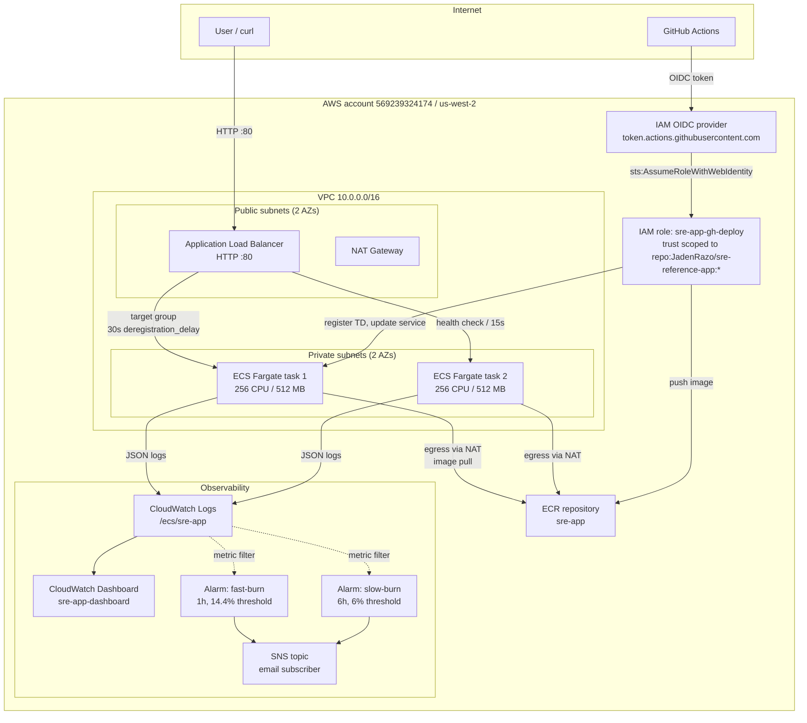
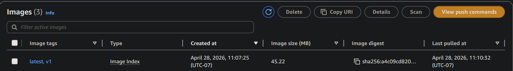
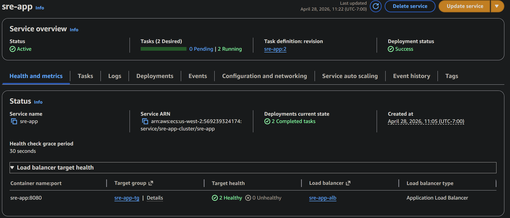
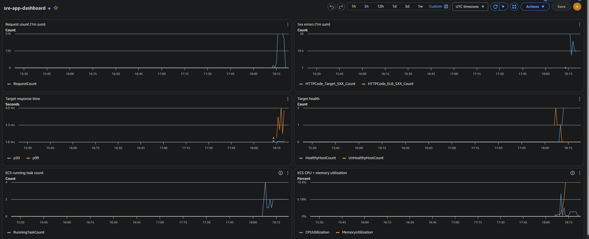
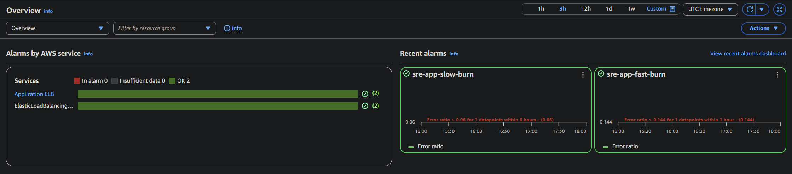
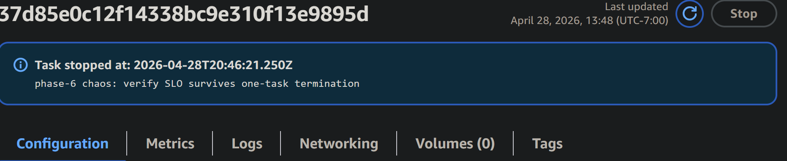
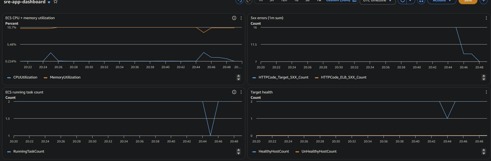
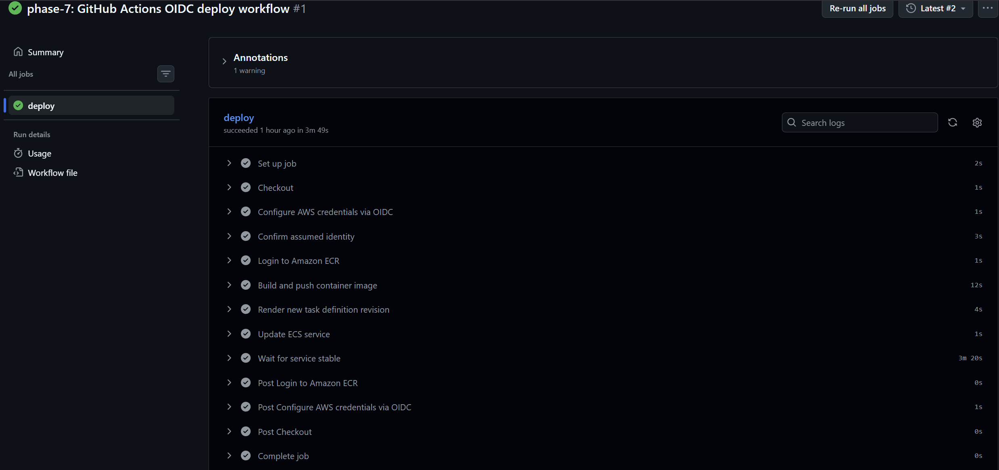

# sre-reference-app

A Flask service deployed to AWS ECS Fargate that survived a controlled task termination in 78 seconds with zero SLO breach (4.46% error rate during chaos vs a 14.4% fast-burn threshold), built end-to-end across 8 phases to show the practices that hold up in real on-call work.

## What this demonstrates

- ECS Fargate service surviving a controlled task termination in 78 seconds with zero SLO breach. Measured error rate during the chaos run was 4.46%, slightly below the 4.83% steady-state baseline, because the surviving task absorbed traffic and the ALB's 30-second `deregistration_delay` drained the dying task cleanly. Full write-up in `docs/chaos-experiments.md`.
- Multi-window, multi-burn-rate SLO alarms wired directly to AWS CloudWatch metric math, sized per Google SRE Workbook Table 5-1 (1-hour window at 14.4x burn rate, 6-hour window at 6x). Both alarms held `OK` through Phase 5 traffic and Phase 6 chaos. See `docs/slos.md`.
- GitHub Actions deploy pipeline with no AWS access keys in the repo, in GitHub Secrets, or anywhere on disk. Federated via OIDC, with the IAM trust policy scoped to `repo:JadenRazo/sre-reference-app:*` so a fork or unrelated repo cannot assume the role even with a leaked workflow file. See `.github/workflows/deploy.yml` and `infra/modules/cicd/`.
- Modular Terraform across `network`, `service`, `observability`, and `cicd`. No inline IAM policy JSON (every policy is built with `aws_iam_policy_document`), no hardcoded ARNs or account IDs, every taggable resource tagged via provider `default_tags`. 47 resources planned, 46 applied (1 FIS template intentionally gated behind `var.enable_fis = false`).
- Structured JSON logging from the first commit. Every request line carries `request_id`, `path`, `status`, and `duration_ms`. The log group `/ecs/sre-app` is queryable in CloudWatch Logs Insights without parsing.
- A custom CloudWatch dashboard with seven widgets covering request count, p50/p99 latency, 5xx rate, ECS task count, target group health, and CPU utilization. Refreshes every 60s.
- A runbook (`runbooks/high-latency.md`) with five ranked common causes and four mitigation steps in escalation order. Direct second-person voice, every command copy-pasteable.
- Honest scope. The chaos test was originally planned on AWS FIS; the new account returned `SubscriptionRequiredException`, so `aws ecs stop-task` produced equivalent blast radius at $0 cost. The FIS template is checked in behind a feature flag and re-enables with one variable flip when the account state changes.

## Architecture



Full architecture writeup with module-by-module breakdown lives in `docs/architecture.md`.

## SLO and alarm summary

The service runs a single availability SLO: 99% of HTTP requests return a status below 500 over a rolling 30-day window. The 1% error budget is policed by two alarms sized per Google SRE Workbook Table 5-1.

| Alarm | Window | Threshold | Burn rate | Page or ticket |
|---|---|---|---|---|
| `sre-app-fast-burn` | 1 hour | 14.4% error rate | 14.4x (2 days to budget exhaustion) | page |
| `sre-app-slow-burn` | 6 hours | 6% error rate | 6x (5 days to budget exhaustion) | ticket |

Verified against live traffic: Phase 5 ran 1347 requests at ~5 req/s for 5 minutes and produced a 4.83% measured error rate; both alarms held `OK`. Phase 6 ran 2154 requests over 8 minutes through a controlled task termination and produced a 4.46% measured error rate with a 78-second recovery window; both alarms held `OK`. The 5% application-level baseline is intentional demo signal, not a target. Math and references in `docs/slos.md`.

## Screenshots

Phase 4 - first deploy:





Phase 5 - observability and SLO verification:





Phase 6 - chaos run:





Phase 7 - OIDC deploy pipeline:



## Quickstart

Local container, no cloud needed:

```
cd app && docker build -t sre-app:local . && docker run -p 8080:8080 sre-app:local
# in another terminal
curl http://localhost:8080/health
```

The `/` route returns 200 most of the time and 500 about 5% of the time (configurable via `ERROR_RATE`). The `/health` route always returns 200; the Dockerfile `HEALTHCHECK` calls it every 30 seconds.

Cloud deploy with Terraform (requires AWS credentials and a region; the build was verified in `us-west-2`):

```
cd infra
terraform init
terraform plan -var "alarm_email=YOUR_EMAIL"
terraform apply
```

After `apply`, push the container image:

```
aws ecr get-login-password --region us-west-2 | \
  docker login --username AWS --password-stdin <account>.dkr.ecr.us-west-2.amazonaws.com

docker build -t sre-app:latest ./app
docker tag sre-app:latest <account>.dkr.ecr.us-west-2.amazonaws.com/sre-app:latest
docker push <account>.dkr.ecr.us-west-2.amazonaws.com/sre-app:latest

aws ecs update-service --cluster sre-app-cluster --service sre-app --force-new-deployment
aws ecs wait services-stable --cluster sre-app-cluster --services sre-app
```

The terraform `outputs.tf` prints the ALB DNS name. Confirm `curl http://$ALB_DNS/health` returns 200.

To enable the OIDC deploy pipeline (Phase 7 setup): the `cicd` module already provisioned the IAM role and OIDC provider during `apply`. Subsequent commits to `main` that touch `app/**` or `.github/workflows/deploy.yml` trigger a fresh deploy with no AWS keys required.

## Project layout

```
app/                       Flask app + Dockerfile
  main.py                  /, /health, /work routes; structured JSON logging; ERROR_RATE env var
  Dockerfile               python:3.12-slim base, HEALTHCHECK on /health, non-root user
  requirements.txt         flask + gunicorn

infra/                     Terraform root
  main.tf                  4 module calls (network, service, observability, cicd)
  variables.tf             region, name_prefix, image_tag, alarm_email, enable_fis
  outputs.tf               ALB DNS, ECR repo URL, deploy role ARN, dashboard URL
  modules/
    network/               VPC, 2 public + 2 private subnets, NAT gateway, route tables
    service/               ALB, target group, ECS cluster + service + task def, security groups
    observability/         CloudWatch log group, dashboard, metric filters, fast-burn + slow-burn alarms, SNS topic, FIS template
    cicd/                  IAM OIDC provider, IAM role with repo-scoped trust, deploy policy

docs/
  architecture.md          Module-by-module breakdown of the topology above
  slos.md                  SLO math, burn-rate derivation, verification against live data
  chaos-experiments.md     Phase 6 hypothesis, method, result, findings
  post-mortem-template.md  Template for incident write-ups; runbook section 5 calls into this

runbooks/
  high-latency.md          On-call procedure for 5xx or latency alarms

screenshots/               Build-day captures referenced from this README

.github/workflows/
  deploy.yml               OIDC-federated deploy: build, push to ECR, register TD, update service

.claude/agents/            Project-scoped subagents that drove the build (terraform-architect, technical-writer, reviewer)

PLAN.md                    Phase plan and operating rules
PROGRESS.md                Phase log with timestamps
LINKEDIN.md                Build-log entries and post drafts
HUMAN_TASKS.md             Manual checkpoints queued for the human
```

## Build phases

Each phase ended with a reviewer pass and a tagged commit. `PROGRESS.md` carries the full timestamped log; the table below is the short version.

| Tag | Phase | What was verified |
|---|---|---|
| `phase-1-complete` | Bootstrap repo + GitHub | Public repo created, README and PLAN scaffolded, .gitignore in place |
| `phase-2-complete` | App + container | Local Docker build, smoke test 50/50 (46x 200, 4x 500), HEALTHCHECK healthy after 15s |
| `phase-3-complete` | Terraform infra | 4 modules + slos.md drafted; `terraform plan` returned 47 to add, 0 change, 0 destroy; `apply` created 46 (FIS template gated off) |
| `phase-4-complete` | First deploy | ECR push succeeded, ECS task definition revision 2 active, service stable 2/2, 19/20 smoke-test 200s |
| `phase-5-complete` | Observability + SLO verification | 1347 requests at ~5 req/s, measured error rate 4.83%, both alarms held `OK` |
| `phase-6-complete` | Chaos via aws ecs stop-task | 2154 requests over 8 minutes, 78-second recovery, 4.46% error rate during chaos vs 4.83% baseline, both alarms held `OK` |
| `phase-7-complete` | CI/CD via OIDC | Workflow run 25071971120 succeeded in 3m49s; first run failed on missing `ecs:TagResource`, fixed via terraform and rerun |

## What this does NOT do

Honest list of out-of-scope items so the architecture is not misread:

- No TLS or HTTPS. The ALB listens on port 80 only. A production deployment would add an ACM certificate, an HTTPS listener on 443, and an HTTP-to-HTTPS redirect. None of that is in this repo.
- No autoscaling. `desired_count = 2` is fixed. CPU pinning on both tasks would not trigger a scale-out event; section 4.3 of the runbook is the manual workaround.
- No multi-region or DR. One region (`us-west-2`), one VPC, two AZs. Region failure means the service is down.
- No real data persistence or PII. The app is stateless. There is no database, no Redis, no secrets manager wiring beyond what the OIDC role itself uses.
- No AWS FIS. The Phase 6 chaos was substituted with `aws ecs stop-task` because the AWS account returned `SubscriptionRequiredException` on the FIS API. The FIS template lives behind `var.enable_fis = false`. See `docs/chaos-experiments.md` for the rationale.
- No latency alarm. The dashboard surfaces `TargetResponseTime` p99, but no CloudWatch alarm currently fires on slow responses without 5xx. Listed as a follow-up in `docs/chaos-experiments.md`.

## Cost

Running the full stack idle, in `us-west-2`, with `desired_count = 2`:

| Resource | Daily | Monthly |
|---|---|---|
| NAT gateway (1) | ~$1.08 | ~$32 |
| Application Load Balancer | ~$0.60 | ~$18 |
| ECS Fargate (2 tasks at 256 CPU / 512 MB) | ~$0.96 | ~$29 |
| CloudWatch logs + dashboard + alarms | ~$0.05 | ~$1.50 |
| Total idle | ~$2.69 | ~$80 |

The NAT gateway is the single biggest line item and exists only so private-subnet tasks can pull images from ECR. Replacing it with a VPC interface endpoint for ECR cuts that cost to roughly $0.30/day at the price of three additional terraform resources. Not done here because the simpler topology was easier to reason about for a reference build.

Tear the whole stack down with one command when finished:

```
cd infra && terraform destroy
```

Confirm a clean destroy with `aws ecs list-clusters` (returns `[]`) and `aws ec2 describe-vpcs --filters Name=tag:Project,Values=sre-app` (returns no VPC).

## License

MIT.

## References

- Google SRE Workbook, chapter 5, "Alerting on SLOs": https://sre.google/workbook/alerting-on-slos/
- Google SRE Workbook, chapter 16, "Disaster Role Playing": https://sre.google/workbook/chapter-16/
- AWS docs on ALB target group `deregistration_delay`: https://docs.aws.amazon.com/elasticloadbalancing/latest/application/target-groups.html#deregistration-delay
- AWS docs on CloudWatch alarm states and missing data: https://docs.aws.amazon.com/AmazonCloudWatch/latest/monitoring/AlarmThatSendsEmail.html#alarms-and-missing-data
- AWS FIS docs on the `aws:ecs:stop-task` action: https://docs.aws.amazon.com/fis/latest/userguide/actions-aws-ecs.html
- GitHub Actions OIDC with AWS: https://docs.github.com/en/actions/deployment/security-hardening-your-deployments/configuring-openid-connect-in-amazon-web-services
