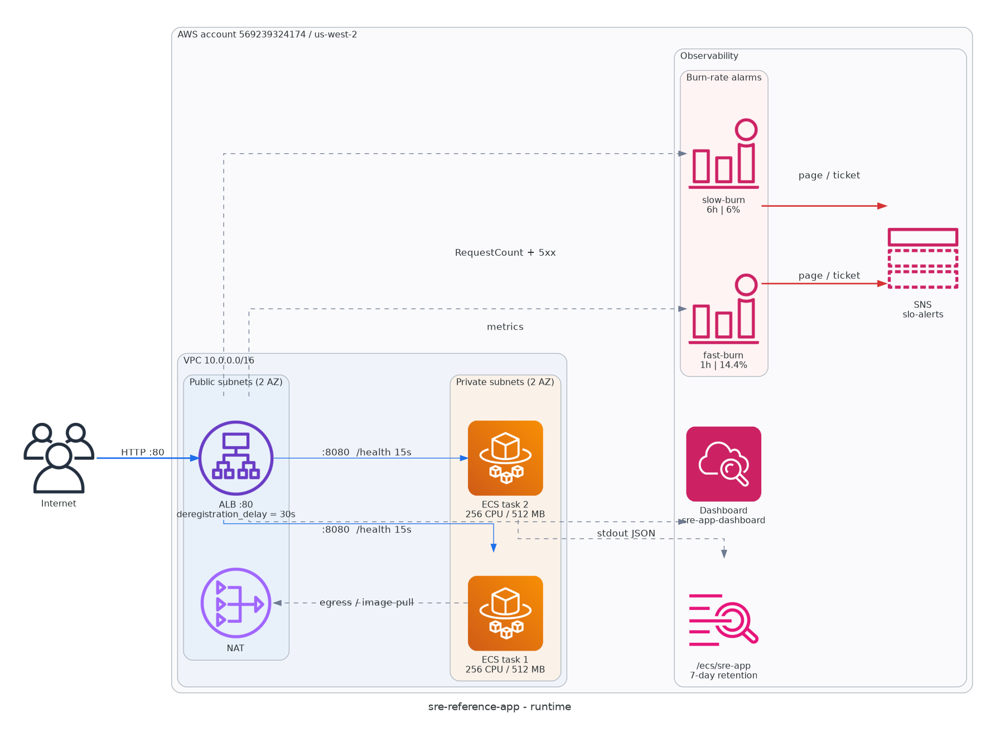
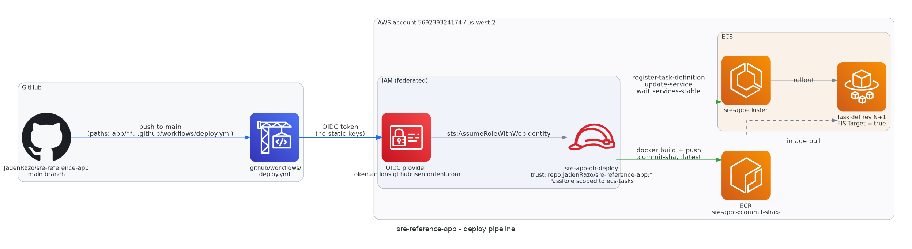

# Architecture

This is a 2-task Flask service running on ECS Fargate behind an ALB in `us-west-2`, fronted by GitHub Actions for deploys and CloudWatch for SLO alarms. Every piece exists for a measured reason: the 30-second ALB `deregistration_delay`, the 14.4x fast-burn alarm, and the OIDC-only deploy path are the load-bearing tuning decisions documented in `slos.md` and `chaos-experiments.md`.

## 1. Diagram

Two diagrams, one story each. Generated from `diagrams/architecture.py` (mingrammer/diagrams + AWS official icon set). Regenerate with `cd diagrams && .venv/bin/python architecture.py`.

### 1a. Runtime: where requests, logs, and metrics flow

### 1b. Deploy pipeline: how a `git push` reaches a running task

The deploy diagram is the security-relevant one. The blue OIDC path replaces what would otherwise be an `AWS_ACCESS_KEY_ID` in GitHub Secrets; the green action edges show the role's narrowly scoped permissions in flight (`docker push` to one ECR repo, `update-service` to one ECS service, `iam:PassRole` locked to `ecs-tasks.amazonaws.com`).

## 2. Components

**VPC and networking** (`infra/modules/network/main.tf`). One `10.0.0.0/16` VPC, two `/24` public subnets, two `/24` private subnets, spread across the first two AZs that report `state = available` and `opt-in-not-required`. One IGW for the public subnets, one NAT gateway in `10.0.1.0/24` for private egress. The NAT carries all task egress (ECR pulls, outbound API calls).

**ALB and target group** (`infra/modules/service/alb.tf`). Internet-facing ALB on HTTP :80, target type `ip` (required for Fargate awsvpc mode). The highlight is `deregistration_delay = 30`. AWS default is 300s; the 30s value is what kept the chaos run from producing a visible 5xx blip. Health check hits `/health` every 15s, requires 2 consecutive 200s to mark healthy.

**ECS Fargate** (`infra/modules/service/ecs.tf`). One cluster, one service, one task definition. `cpu = 256`, `memory = 512`, `desired_count = 2`. `propagate_tags = "TASK_DEFINITION"` carries the `FIS-Target = "true"` tag from the task def to the running tasks so AWS FIS can target them when available. `lifecycle.ignore_changes = [task_definition, desired_count]` lets the GitHub Actions workflow register new revisions without `terraform apply` reverting them on the next plan.

**ECR** (`infra/modules/service/ecr.tf`). One repository, `scan_on_push = true`, `image_tag_mutability = "MUTABLE"` so `:latest` can move. Lifecycle policy has two rules: priority 1 expires untagged images after 1 day, priority 2 keeps only the last 10 of whatever remains. Net effect: at most ~10 images live in the repo regardless of deploy frequency.

**CloudWatch dashboard** (`infra/modules/observability/dashboard.tf`). 6 widgets at 60-second period: request count (1m sum), 5xx count (target + ELB), target response time (p50 + p99), target health (healthy + unhealthy host count), ECS running task count, and ECS CPU + memory utilization. The dashboard is the screenshot surface for `06-dashboard-during-chaos.png`.

**Burn-rate alarms** (`infra/modules/observability/alarms.tf`). Two alarms, both using `metric_query` with `IF(m2 > 0, m1 / m2, 0)` to guard against divide-by-zero on idle minutes. Fast-burn: 1-hour window, threshold `(1 - 0.99) * 14.4 = 0.144`. Slow-burn: 6-hour window, threshold `(1 - 0.99) * 6 = 0.06`. Both set `treat_missing_data = "notBreaching"`, the setting that kept the Phase 6 chaos run from producing a false page on the 1-hour window.

**SNS** (`infra/modules/observability/sns.tf`). One topic, one email subscription. The subscription stays in `pending_confirmation` until the recipient clicks the AWS-sent confirmation email. The alarm fires regardless; only the email delivery requires confirmation. Production would route the same topic to PagerDuty.

**GitHub OIDC + deploy role** (`infra/modules/cicd/main.tf`, `policies.tf`). The trust policy gates `sts:AssumeRoleWithWebIdentity` on two conditions: `:aud = sts.amazonaws.com` and `:sub StringLike repo:JadenRazo/sre-reference-app:*`. Four attached policies: ECR push (scoped to this repo), ECS deploy (UpdateService scoped to this service), `iam:PassRole` (scoped to the two ECS task roles, with `iam:PassedToService = ecs-tasks.amazonaws.com`), and CloudWatch Logs read. No static AWS credentials exist anywhere.

## 3. Request path

A single `GET /` from a browser to a 200 response:

1. Browser resolves the ALB DNS name (e.g. `sre-app-alb-xxxx.us-west-2.elb.amazonaws.com`) to one of the ALB's public-subnet IPs.
2. ALB receives the request on listener :80, picks one of the two registered targets that is currently healthy (passed 2 consecutive `/health` 200s in the last 30s).
3. ALB forwards the request to the chosen Fargate task on container port 8080 over the private subnet.
4. Gunicorn hands the request to Flask. The `before_request` hook stamps `X-Request-ID` and a `time.perf_counter` start. The handler runs: `random.random() < 0.05` triggers a 500 with `{"error": "intermittent"}`; otherwise 200 with `{"hello": "world"}`.
5. The `after_request` hook computes `duration_ms`, sets `X-Request-ID` on the response, and returns it back through the ALB to the browser.
6. Gunicorn writes a single JSON line to stdout. The awslogs driver ships it to `/ecs/sre-app` with fields `timestamp, level, message, app, version, request_id, method, path, status, duration_ms, remote_addr`. Retention on the log group is 7 days.

## 4. Deploy path

A `git push` editing `app/main.py` to a new task revision running:

1. The `deploy` workflow (`.github/workflows/deploy.yml`) triggers on push to `main` with path filter `app/**`.
2. The job requests an OIDC token (`permissions: id-token: write`) and exchanges it for `sre-app-gh-deploy` via `aws-actions/configure-aws-credentials@v4`. No static keys are stored in the repo.
3. `aws-actions/amazon-ecr-login@v2` provides the docker registry login. `docker build` against `./app` tags the image with `${{ github.sha }}` and `:latest`, then pushes both.
4. The render step calls `describe-task-definition --include TAGS`, swaps the `image` field with the new SHA via `jq`, preserves the `FIS-Target` tag in the registered revision, and calls `register-task-definition`.
5. `aws ecs update-service --task-definition <new ARN> --force-new-deployment` against `sre-app-cluster` and `sre-app`.
6. `aws ecs wait services-stable` blocks until `runningCount == desiredCount` with the new revision. Typical wall-clock for this step is 1 to 2 minutes once the Fargate task pulls the new image.

## 5. SLO and chaos posture

The service runs a 99% availability SLO over a 30-day window (`slos.md`). The fast-burn alarm fires on a sustained 14.4% error rate over 1 hour, which would deplete the 30-day budget in 2.08 days; the slow-burn alarm fires on a sustained 6% error rate over 6 hours, depleting in 5 days. Phase 5's 5-minute steady-state run measured 4.83% error rate over 1,347 requests, well below either threshold; both alarms held `OK`. Phase 6's chaos experiment (`chaos-experiments.md`) terminated 1 of 2 tasks via `aws ecs stop-task` during sustained 5 req/s traffic. The replacement task reached steady state at T+78 seconds. Measured error rate over the 8-minute, 2,154-request run was 4.46%, slightly below the no-chaos baseline. Both alarms held `OK`. The 30-second `deregistration_delay` setting is the load-bearing reason no 5xx spike appeared during the 78-second recovery window.

## 6. Trade-offs and known limitations

- One NAT gateway in a single AZ. Production should run one-per-AZ; an AZ outage on `us-west-2a` blackholes egress for the surviving private subnet.
- The 30-day SLO window is hardcoded into the alarm math (`14.4x` and `6x` are the documented multipliers for that specific window length). Changing to a 7-day or 28-day window requires recomputing both thresholds.
- AWS FIS is not used; the account returns `SubscriptionRequiredException` on the FIS API. The chaos experiment substitutes `aws ecs stop-task`, which produces the same blast radius. The FIS template stays in the module behind `var.enable_fis = false`.
- TLS is not configured on the ALB. Listener is HTTP :80 only; any production deployment should add a :443 listener with an ACM certificate and redirect :80 to :443.
- No autoscaling is configured. `desired_count = 2` is fixed; a sustained traffic spike past 2-task capacity will produce real 5xx.
- No latency-based alarm. The dashboard renders `TargetResponseTime` p99, but only the error-rate burn-rate alarms fire. A task that becomes slow without dying would not page.
- The OIDC trust policy uses `repo:JadenRazo/sre-reference-app:*`, which matches any branch, tag, or PR. Production should narrow to `repo:OWNER/REPO:ref:refs/heads/main` or `repo:OWNER/REPO:environment:production`.
